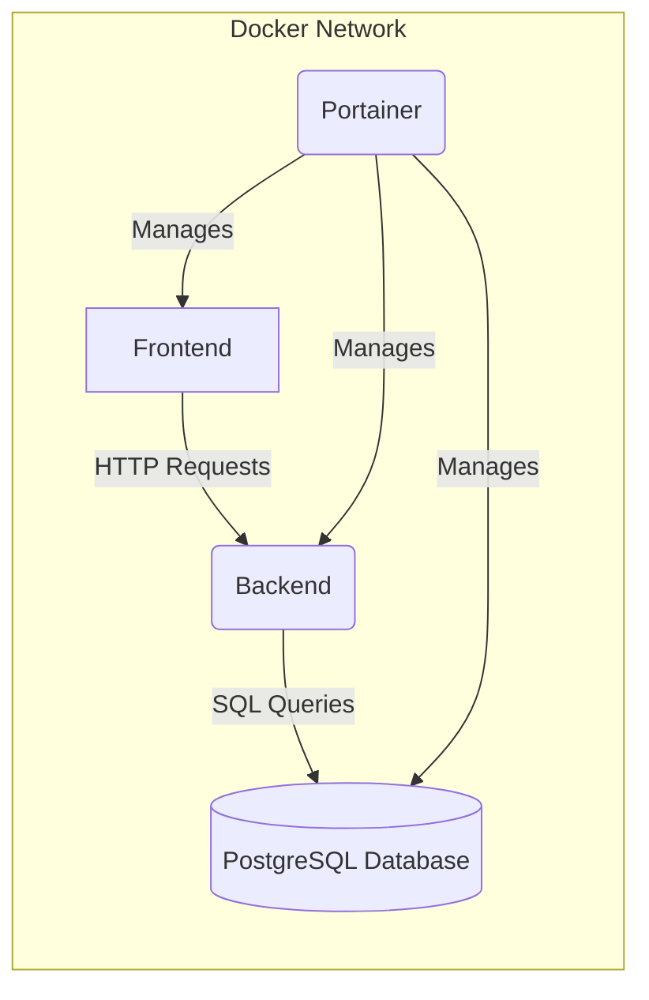


# Workshop Booking Application

This project is a workshop booking application that consists of three main services: a backend API server, a PostgreSQL database, and a Vue.js frontend. The application allows users to view available workshop venues and book workshops through a simple interface.

## Architecture Overview

The application architecture consists of the following components:

- **Frontend**: A Vue.js application that serves as the user interface, allowing users to view and book workshops.
- **Backend**: A Node.js Express server that provides RESTful APIs for fetching and booking workshops.
- **Database**: A PostgreSQL database that stores workshop data, including availability status.
- **Portainer**: A web-based Docker management tool for easy container management.

### Application Diagram



## Pages

1. **Main Page (Workshop Venues)**:
   - Displays a list of workshops with details such as venue name, date, and availability.
   - Allows users to book available workshops.

## Running the Application

To run the application locally using Docker, follow the steps below:

### Prerequisites

Ensure you have Docker and Docker Compose installed on your system.

### Steps

1. **Clone the Repository**

   Clone this repository to your local machine:

   ```bash
   git clone https://your-repository-url.git
   cd your-repository-folder
   ```

2. **Build and Start the Containers**

   Use Docker Compose to build and start the containers:

   ```bash
   docker-compose up --build
   ```

3. **Access the Application**

   - **Frontend**: Open your browser and navigate to `http://localhost:8080`.
   - **Backend API**: The backend can be accessed at `http://localhost:5000`.
   - **Portainer**: Navigate to `http://localhost:9091` to view the Portainer UI.

### Docker Compose File Structure

The Docker Compose file organizes services into the same Docker network allowing seamless service-to-service communication. `Postgres` serves as the database, `node-backend` handles API requests, and `vue-frontend` provides the user interface.

### Environment Variables

Ensure the environment variables are correctly configured in the Docker Compose file for database connection:

- **DB_HOST**
- **DB_USER**
- **DB_PASSWORD**
- **DB_NAME**

## Conclusion

The Workshop Booking Application is designed for simplicity, streamlined interactions between the frontend, backend, and database all managed within a Docker environment. Feel free to contribute to this project or suggest improvements.
